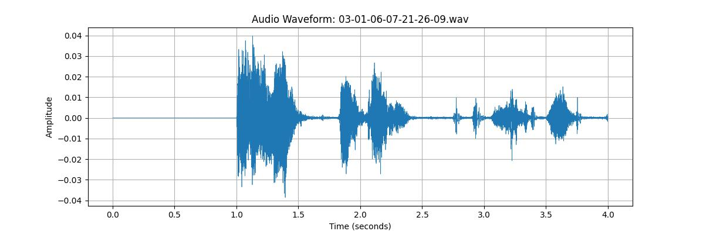

# 🎙️ Emotion Recognition from Voice using Machine Learning

## 😃🔊 Project Overview

This project is a Machine Learning-based system that detects **emotions from raw human voice recordings** — without relying on speech-to-text. By analyzing **acoustic features** such as pitch, MFCCs, tone, and spectrograms, the model classifies speech into emotional states like *happy, sad, angry, neutral*, and more.

> ⚡ Built to be **language-independent**, this system is ideal for real-time applications in **mental health monitoring**, **empathetic voice assistants**, and **customer service analytics**.

---

## 🚀 Key Features

- 🎧 **Audio-only Emotion Detection** (No transcription needed)
- 📊 Feature extraction: **MFCCs, Chroma, Spectral Contrast, Tonnetz**
- 🧠 Trained on multilingual emotional speech datasets
- 🌍 Language-agnostic design
- 📈 Supports real-time and batch predictions
- 🧪 Includes test data and visualization scripts

---

## 🧪 How It Works

### 1️⃣ Feature Extraction
We extract acoustic features using `librosa`:
- MFCC (Mel Frequency Cepstral Coefficients)
- Chroma Frequencies
- Spectral Contrast
- Tonnetz
- Zero Crossing Rate, Energy, etc.

### 2️⃣ Model Training
Models used:
- SVM (Support Vector Machine)
- MLP (Multi-Layer Perceptron)
- Optionally: CNN for spectrograms

### 3️⃣ Emotion Prediction
Feed an audio sample to the model:
```bash
python src/predict.py --file data/test_sample.wav
```

## 🛠️ Installation
### 1. ⚙️ Requirements

```bash
pip install -r requirements.txt
```
### Or

### 2. 🐍 Create a Virtual Environment
```bash
python -m venv venv
source venv/bin/activate # on macOS/Unix
venv\Scripts\activate # on Windows
pip install -r requirements.txt
```

## 📊 Sample Results

Here’s a visual summary of the model's performance across different emotions:

### 1. Classification Report


> 🎯 The graph shows high precision and recall for emotions like *Sad* and *Neutral*, with consistent accuracy across all categories.

### 2. Wave-Output



> 🎯 The above image represents the Realtime Wave-Form of Recorded audio, measured by Time / Seconds.

### 3. Prdeiction-Output


> 🎯 The above image represents the Emotion Detected after analysing the audio in realtime (live recorded audio)